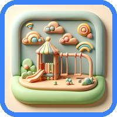
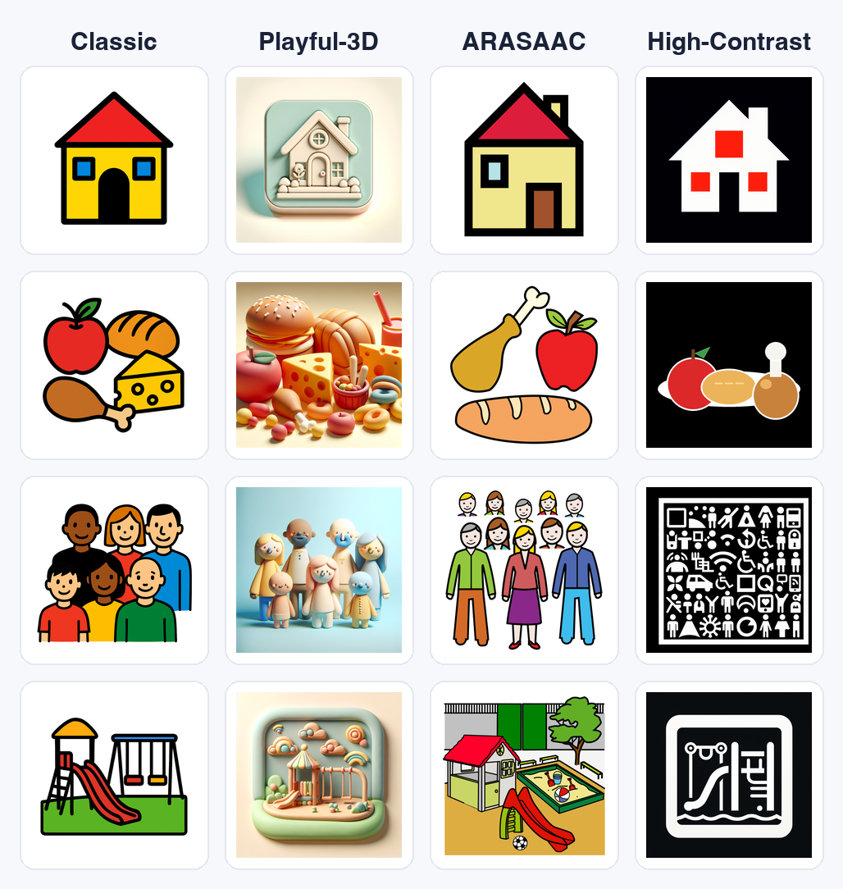
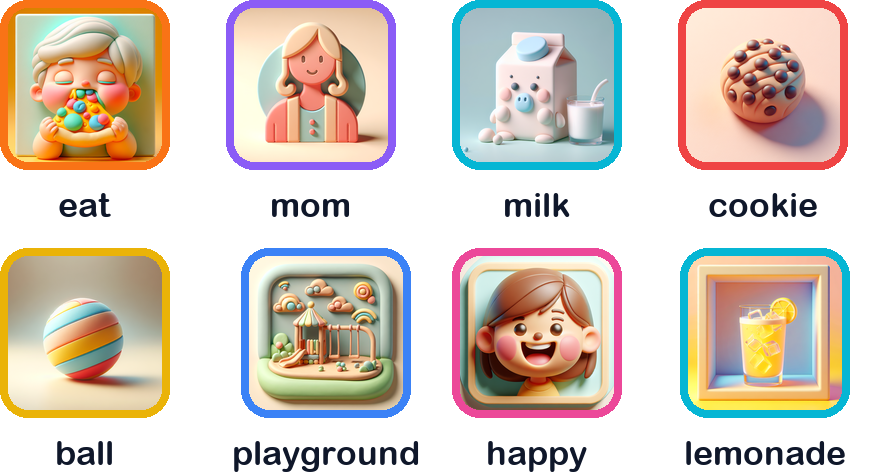

<!-- _class: cover -->
<!-- _paginate: false -->
<!-- _footer: '' -->

# BlasterAI

## A voice for non-verbal children

 

*A free iPad & iPhone app · Private by design · Open source*

<a href="https://blasterai.app">blasterai.app</a> · Sentence & image generation by OpenAI · Developed with Claude

Updated July 2026

---

<!-- _class: divider -->
<!-- _paginate: false -->

### The problem

# Every child has something to say.
# The gap is access, not ability.

---

## The access gap is enormous

1M+
U.S. children who could benefit from AAC

 

~2%
of SLPs specialize in AAC

**Why the gap?**

- **Cost** — dedicated devices run **$5K–$15K**; the leading apps cost **$250–$300** (one-time or subscription)
- **Funding friction** — approval **plus appeals** often stretch to **6–12 months**
- **Awareness & equity** — access varies sharply by **district wealth**, race, and income; many families never reach an AAC specialist
- **~35–55K new children** enter the pipeline every year

Sources: Light & McNaughton 2012; ASHA SIG-12; CHLA; WHO/UNICEF 2022. Rigorous national AAC-access data is scarce — figures are sourced estimates.

---

<!-- _class: divider -->
<!-- _paginate: false -->

# Where a child lives
# shouldn't decide whether they're heard.

*AAC access tracks wealth and paperwork. While it grinds on, the child keeps falling further behind their peers.*

---

<!-- _class: divider -->
<!-- _paginate: false -->

### The solution

# BlasterAI

*AI helps a child be heard —
and helps the grown-ups around them grow that voice.*

Free to use · Private by design · Open source

---

## What BlasterAI is

**It's both** — a **free app** anyone can download from the App Store (child *and* caregiver), **and** an **open codebase** (Apache 2.0) anyone can inspect or fork.

- **iPad & iPhone** — the same voice, at home and on the go
- **AI sentence generation** — tiles become natural, age-appropriate speech
- **AI image & scene generation** — grow vocabulary, build boards in seconds
- **Private by design** — no backend, no analytics, on-device data

The `home` tile in Playful-3D, the default art style.

---

## Two devices, one voice

<a class="demo" href="https://blasterai.app/demo/#v6">▶ Watch Demo</a>

**At home**, the child's iPad is always within reach — the family room, the lunch table, the therapy session.

**On the go**, they don't have to carry it. At the store, at Costco, at grandma's — **a parent's iPhone becomes the child's voice** the moment they need it.

Same child, same words, same scenes — because everything syncs through the family's own iCloud.

> A voice shouldn't be something you can leave at home.

Because BlasterAI is a normal iOS app, any iPhone in the family is a spare communication device.

---

## For the child: tap tiles → speak in full sentences

<a class="demo" href="https://blasterai.app/demo/?single-column-demos=1#v1">▶ Watch Demo 1</a> &nbsp; The child taps a few tiles, and BlasterAI speaks a **complete sentence** — never word-salad.

+

→

🔊&nbsp; Grandpa, let's go to the playground!

+

→

🔊&nbsp; Grandpa, let's go to the playground and get some lemonade!

*Tiles are **additive** — tap `lemonade` and the sentence grows to include it. The child builds the meaning; BlasterAI turns it into what they actually mean.*

---

<!-- _class: divider -->
<!-- _paginate: false -->

### The AI advantage

# Runtime AI is table stakes.
# What we *do* with it isn't.

---

## Three superpowers — for the child *and* the caregiver

### 1 · Sentences
Not word-salad — real, age-appropriate speech that carries **emotion and urgency**, and whose quality we **measure in an eval harness**.

### 2 · Images
Add any word and BlasterAI **generates a matching tile** — styled to the child's art set, and refinable.

### 3 · Scenes & vocabulary
Describe a goal in plain English → a **complete board in seconds**, plus ready-made packs to grow into new worlds.

 

*Every one of these serves two people at once: it helps the **child** be heard, and gives the **caregiver** a way to grow that child's world.*

---

## 1 · Sentences — intent, not grammar

AI advantage · sentences

> A child's tiles are **intent**, not grammar.
> BlasterAI's job is to turn intent into the sentence the child *meant*.

- **Self-centered by default** — `mom` + `milk` → *"Mom, can I have some milk?"*, not *"Mom, you should drink milk."*
- **Age-adaptive** — grammar and vocabulary tuned to the child's grade level
- **Conversational** — the last 5 sentences feed back as context, so follow-ups feel natural
- **Word-class aware** — tiles are annotated (`mom (people), eat (actions)`) so ambiguous words resolve correctly

---

## 1 · Sentences — repetition is the volume knob

AI advantage · sentences

<a class="demo" href="https://blasterai.app/demo/?single-column-demos=1#v2">▶ Watch Demo 2</a>

A non-verbal child can't shout — so to mean it more, they **repeat.** BlasterAI hears that as rising urgency and **escalates the language** with each repeat.

Same tiles — `grandpa` `playground` `lemonade` — asked again:

1. "Grandpa, let's go to the playground and get some lemonade!"
2. **"Grandpa, I really want to go to the playground and get some lemonade — right now!"**

> "The device must understand repetition and escalate urgency and tone accordingly."

— product requirements, "repetition as intensity"

---

## 1 · Sentences — we measure quality, not vibes

AI advantage · sentences

BlasterAI ships with an **AI evaluation harness**: a Tier‑1 deterministic checker plus a Tier‑2 LLM judge that score our sentence generations in a test suite against a rubric.

It caught the escalation problem, we fixed the prompt, and the harness **proved the fix**.

Escalation quality — judge pass rate

38% before
 
85% after

 

Deterministic escalation checks
**0% → 100%** passing

Baseline locked in-repo. Subject gpt-4o-mini · judge gpt-4o.

---

## 2 · Images — a child's world isn't a fixed vocabulary

AI advantage · images

Every child's vocabulary is personal — BlasterAI isn't limited to the tiles it ships with.

- **Add any word** → BlasterAI generates a tile with OpenAI `gpt-image-1`
- **Style-matched** — the tile looks like it belongs in the child's art set
- **Refinable** — *"give the dragon a purple tail"* → it re-renders, same style
- **Syncs everywhere** — to every family device

A generated tile matches whichever set is active.

---

## 3 · Scenes — a board in seconds

AI advantage · scenes & vocabulary

<a class="demo" href="https://blasterai.app/demo/?single-column-demos=1#v3">▶ Watch Demo 3</a>

Today, therapists hand-pick vocabulary from **5,000–10,000+** items — hours per board. In BlasterAI, they *describe the goal*:

> "feelings for a 5-year-old working on frustration vs anger"

...and get a **complete, ready-to-use scene** in seconds — pages, tiles, images, and navigation, all wired up. **Hours → minutes.**

`cow`, from the ready-made Farm pack — scenes and packs export as shareable JSON.

---

## Built around the real child

- **Per-child profiles** — name, age, voice, vocabulary size, therapist notes
- **Two interaction modes** — AI sentences *or* classic single-word AAC, per child
- **Caregiver menu** — long-press to a PIN + Face ID gated admin, invisible to the child
- **Swappable art sets** — same vocabulary, different aesthetic for different kids

Same vocabulary, four art sets. Playful-3D ships as default; Classic, ARASAAC, and High-Contrast swap in.

<a class="demo" href="https://blasterai.app/demo/?single-column-demos=1#v4">▶ Watch Demo 4</a>

---

## Privacy is the architecture, not a policy

- **No backend.** No servers we run, ever.
- **On-device data** — SwiftData, syncing only through the family's own iCloud
- **Stateless AI calls** — tiles in, sentence out; no identity, no history stored by us
- **Secrets in Keychain** — the API key never lives in plaintext
- **Gated admin** — Face ID + salted/hashed PIN

> For a product used by **children**, trust can't be a paragraph in a privacy policy. It has to be the way the thing is built.

---

## The technology

**Runtime**
- SwiftUI + SwiftData, iOS 26+, iPad & iPhone
- Sentences: OpenAI **`gpt-4o-mini`** · Tiles: **`gpt-image-1`**
- **Cache-first** — repeated phrases replay instantly, offline, for free
- Typical use: **well under $1 / child / month**; on-device models (Apple Intelligence) could take it to **$0**

**How it's built**
- Developed end-to-end with **Claude Code** — planning, implementation, review, PRs
- ~52K lines of Swift, eval-tested
- Open source from day one (Apache 2.0)

**500+ words** (with built-in packs) · **1,500+ AI-generated tile images** across Playful-3D, Classic & High-Contrast.

---

## The life of BlasterAI

**It started by watching kids wrestle with yesterday's AAC tools — and their moms struggle right alongside them.** When the software is built for a different era, the child *and* the caregiver work too hard. People expect an AI app to ship *fast*; what they don't expect is the **depth** behind doing it right:

- **Ideation & research** — watching children saddled with dated tools; understanding AAC, families, and the access gap
- **Product design** — the PRD, the "repetition as intensity" insight, a privacy-first architecture
- **Competitive analysis & GTM** — mapping the landscape and the positioning
- **Art & vocabulary** — a **500+ word** vocabulary with **1,500+ AI-generated** tile images across styles, plus expansion packs
- **Built & shipped** — a working iOS app: onboarding, profiles, sentence + image + scene generation, eval-tested

### ▶ Up next: a TestFlight pilot — real therapists & families, a caregiver feedback loop → then App Store launch

---

<!-- _class: divider -->
<!-- _paginate: false -->

### Where we're going

# A free voice
# for every child with something to say.

*Open source. Privacy-first. Ready to pilot.*

---

## The ask

**Therapists & educators**
Pilot with us. Tell us where AI helps and where it gets in the way. Shape the roadmap toward real clinical value.

**Anthropic**
Continued partnership on the build — and on the evaluation rigor behind putting AI in a child's hands.

**OpenAI**
The runtime that helps these children be heard — sentences *and* images. Let's make it faster, cheaper, and even safer together.

 

> BlasterAI exists because of this support. Thank you — and let's get it into kids' hands.

 

<a href="https://blasterai.app">blasterai.app</a> · <a href="https://github.com/marklucovsky/blasterai">github.com/marklucovsky/blasterai</a> · Apache 2.0

---

<!-- _class: cover -->
<!-- _paginate: false -->
<!-- _footer: '' -->

# Thank you

## Let's help more kids be heard.

 

<a href="https://blasterai.app">blasterai.app</a> · Mark Lucovsky · <a href="mailto:support@blasterai.app">support@blasterai.app</a>

---

<!-- _class: divider -->
<!-- _paginate: false -->

# Appendix

*Audience-specific detail*

---

## Appendix A — Market & impact

- **~1M+** U.S. children could benefit from AAC (Light & McNaughton 2012) — part of **~4–5M of all ages** (Beukelman & Light 2020). National *access* data is scarce; documented gaps are equity gaps (e.g. **32% vs 84%** device access by race in minimally-verbal autism — CHLA)
- **~35–55K** new children/year become AAC candidates — autism ~30–38K (of ~116K new diagnoses at 1-in-31), apraxia ~4–7K, cerebral palsy ~2–3K
- **AAC device market growing ~7–9%/yr** (Grand View Research); CDC autism prevalence 1-in-44 (2018) → 1-in-31 (2022) — part real, part better identification
- **Incumbent pricing:** Proloquo ~$100/yr (vs Proloquo2Go $249.99 one-time); TD Snap freemium ~$120/yr; TouchChat + WordPower $299.99; devices **$5K–$15K**
- **BlasterAI:** free app + AI usage **well under $1/month** at typical use
- **No major AAC app builds full sentences from selected symbol tiles with an LLM** — incumbents ship prediction, grammar fixes, AI images, and TTS; our edge is the *combination*

---

## Appendix B — AI architecture & evaluation

**Runtime pipeline**
1. Tiles tapped → 350ms debounce
2. Cache-first lookup (order-independent key)
3. Miss → OpenAI call with system + user + last-5-sentence context
4. Staleness guard discards results if tiles changed in flight
5. Speak + cache

**Models:** `gpt-4o-mini` for sentences & scenes, `gpt-image-1` for tiles. Prompts load from editable JSON.

**Evaluation harness**
- **Tier 1** — deterministic checks (does escalation strictly increase? are safety rails held?)
- **Tier 2** — `gpt-4o` LLM judge scores against a rubric
- Subject/judge models **decoupled**; runs opt-in and reproducible
- Locked baseline: escalation judge pass **38% → 85%**, deterministic **0% → 100%**

**Safety:** persona + content rails in the system prompt ("never sexual, violent…") sent on **every** call, with a deterministic safety net + judge in eval.

---

## Appendix C — How BlasterAI is built (dev workflow)

- **Claude Code** is the primary development interface — planning, implementation, code review, and full git lifecycle (worktree → commit → PR → merge)
- Every non-trivial feature starts in **plan mode**: written plan, human approval, then execution
- Collaborator workflow is **documented in-repo** so new contributors onboard fast
- **AI in two roles, cleanly separated:**
  - *Development* — Anthropic's Claude builds the app
  - *Runtime* — OpenAI's models help the child be heard (sentences) and grow their vocabulary (images)
- Result: **~52K lines of Swift, eval-tested, iOS 26**, shipped and headed to pilot — built by a very small team moving fast

---

## Appendix D — Privacy & trust details

- **Storage:** SwiftData on-device; optional sync via the family's **own** iCloud (CloudKit private database). No BlasterAI-operated servers.
- **AI calls:** stateless to OpenAI. Tiles → sentence; word → tile image. No user identity, no conversation persistence on any BlasterAI infrastructure.
- **Bring-your-own-key:** families/therapists supply their own OpenAI key, stored in the iOS **Keychain**. Keys can be scoped to specific models with spend caps.
- **Admin gate:** Face ID + salted/hashed PIN, re-arming on dismiss.
- **Open source:** the entire privacy posture is **auditable** — Apache 2.0, nothing hidden.
